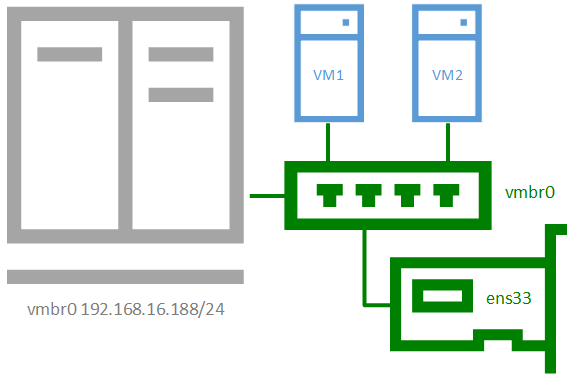

# 01.01 Operation Systems - Базовая установка

## Теория

### Глоссарий
- ВМ: sandbox окружение, в котором эмулируется или прокидывается железное оборудование (диск, видеокарта, флешка, звук и т.п).
- Образ ВМ: слепок диска, как правило с установленной ОС.
- Образ - слепок диска, позволяющий совершать какие-либо действия. Как просто установку из него, так и полноценную работу.
- Гипервизор: ПО для запуска нескольких ВМ на одной физической машине
- GRUB / UEFI: графическая оболочка над BIOS
- X - Server: графическое окружение (GUI) для Unix
- NAT: Network Address Translation использование адреса одного сервера для нескольких виртуальных машин
- Протокол IP: маршрутизируемый протокол сетевого уровня (L3), предназначенный для передачи данных между сетями. Единицей передачи данных на уровне IP-протокола является пакет.
- Сетевой мост (bridge) - При работе в режиме сетевого моста виртуальные машины будут находиться в одной подсети с гипервизором и использовать IP-адреса этой подсети.
- conntrack система отслеживания состояния соединений и принадлежностью пакетов этим соединениям
- MASQUERADE: (маскарадинг) iptables action in nat table, algorithm that allows one to route traffic without disrupting the original traffic. Маскарадинг самостоятельно получает IP-адрес от заданного сетевого интерфейса и не требует его явного указания.
- DNS: Domain Name System, преобразует доменные имена, удобные для человеческого восприятия (например, www.amazon.com), в IP-адреса, понимаемые машиной (например, 192.0.2.44).

### Чем различаются дистрибутивы Linux
Различия:
- Глобальные
  - цели (десктоп, Server, IOT, Cloud)
  - надежность / стабильность (LTS)
- Технические
  - с привязкой к железу или переносимые
  - версия ядра (systemd у Debian / Ubuntu,)
  - пакеты (RPM-пакеты, DPK-пакеты)
  - X - сервер (Gnome ,KDE, Cinnamon и т.п)

### VirtualBox, VMWare, Parallels, vagrant, QEMU
- VirtualBox: open source Desktop решение для виртуализации.
- VMWare / Parallels: corporate Desktop решение для виртуализациии.
- QEMU: open source Desktop решение для виртуализации.

## 1. Базовая установка

### Установка Debian (Proxmox)
Proxmox Virtual Environment - open source платформа виртуализации на основе гипервизора KVM.  
Решил взять Proxmox, чтобы сразу привыкать к кластерам и не устанавливать ручками с флешки (навыком накатывания флешки из образов обладаю), внутри у него Debian.
В целом установка не отличается от обычной установки debian, с некоторыми нюансами. После установки желательно установить community скрипты.
- CE скрипты после установки [старое](https://github.com/tteck/Proxmox?tab=readme-ov-file) -> [новое](https://github.com/community-scripts/ProxmoxVE/blob/main/misc/post-pve-install.sh)

#### Настройка сети в Proxmox
Решил настроить сеть между хостом и дочерними ВМ в режиме сетевого моста (bridge). ВМ и Хост будут в одной подсети и использовать IP-адреса этой подсети т.н [внешняя сеть](https://interface31.ru/tech_it/2019/10/nastraivaem-set-v-proxmox-ve.html).  
DHCP / DNS сервером выступает сетевой маршрутизатор. Во всех случаях нужно учесть, что порты открыты на роутерах / хосте / сетевых брандмауерах. Более подробно про сети см. в [01_01_Network_iptables.md](additional/01_01_Network_iptables.md) и т.п.


##### Хост
Рабочий вывод после `nano /etc/network/interfaces` см. в [host_interfaces.d](../../work_directory/01/host_interfaces.d).
Рабочий вывод после `nano /etc/resolv.conf` см. в [resolv.conf](../../work_directory/01/host_resolv.conf).  
Рабочий вывод после `iptables -t nat -L`: пустая таблица.

##### Дочерняя VM
- Network Device: Intel E1000 (virtIO может не работать под Windows)
- Рабочий вывод после `nano /etc/network/interfaces` см. в [vm_interfaces.d](../../work_directory/01/vm_interfaces.d)

## 2. Создание n ВМ
- Из дистрибутивов взял Debian 12 из образа. Proxmox позволяет указать либо конкретный URL, либо выбрать из предустановленных.
- На основе образа завел 3 виртуалки под QEMU, специально не стал клонировать, а именно через Create VM.
- Нейминг VM: n.child.debian
- Каждую вручную установил через Graphical install.
- По-дефолту завел пользователя root и kirillkonovalov.

### Troubeshooting
- trying to aquire lock...TASK ERROR: can't lock file '/var/lock/qemu-server/...
  - manually deleting the file under /var/lock/qemu-server/lock-XXXXXX.conf works for me.
- Отключить X-Server: `systemctl set-default multi-user.target`
  - для включения: `systemctl set-default graphical.target`

### Ручное добавление пункта меню в Grub (dualboot)
**Простой путь**
- `nano /etc/default/grub`: конфиг grub
- `GRUB_DISABLE_OS_PROBER=false`: включаем os-prober
- `update-grub2`: обновляем конфиг grub
**Сложный путь**
- `fdisk -l`: Выводит список партиций, нужно искать или грепнуть по Type = EFI.
  - найти его путь вида `/dev/sda2` или `/dev/nvme0n1p1`
- `blkid /dev/nvme0n1p1`: вывести UUID (например 3C26-6A4C)
- `lsblk -no uuid /dev/nvme0n1p1`: вывести только UUID
- `chmod o+w 40_custom`: опционально дать доступ на запись
- `chmod o-w 40_custom`: убрать доступ на запись
- `nano /etc/grub.d/40_custom`: открыть на запись template
- добавить:
  - ```
    menuentry 'Windows' {
      search.fs_uuid $uuid
      chainloader /EFI/Microsoft/Boot/bootmgfw.efi
    }```
  - где uuid, это ид партиции с efi
  - или ```
    menuentry 'Windows 11' {
      search --fs-uuid --no-floppy --set=root 3C26-6A4C
      chainloader (${root})/EFI/Microsoft/Boot/bootmgfw.efi
    }```
- `update-grub2`: обновить конфиг или
- `grub-mkconfig -o /boot/grub/grub.cfg`: вручную создать конфиг из template и записать в текущий

## Вопросы к ментору
- Unix
  - Как размечать диски в Unix?
    - Предлагамая Схема разметки:
      1: Все файлы в одном разделе (рекомендуется новичкам) [*],
      2: Отдельный раздел для /home,
      3: Отдельные разделы для /home, /var u /tmp,
    - ExFat или ext4?
  - Как накатываются мажорные обновления ОС? Что учитывать?
- Сеть
  - Какой тип сети используется для гипервизоров? сетевой мост?
  - VM генерирует рандомны MAC. А что если будут коллизии?
  - Как пробросить ВМ за NAT?
  - Почему мог поменяться физический адрес сетевого интерфейса? (enp6s0 -> enp112s0)
- Администрирование
  - Пароль от рута виртуалки один на все или всегда разный? Как провайдить / хранить пароли?
  - Почему мог не сработать os-prober после  `update-grub2` ? Пришлось вручную доавблять конфиг. Хотя `os-prober` видел партицию.
  - Как скрыть видимость использования VM для Windows?

## Полезные ссылки
- Сеть
  - [Основы iptables для начинающих. Часть 1. Общие вопросы](https://interface31.ru/tech_it/2020/02/osnovy-iptables-dlya-nachinayushhih-chast-1.html)
  - [Основы iptables для начинающих. Часть 2. Таблица filter](https://interface31.ru/tech_it/2020/09/osnovy-iptables-dlya-nachinayushhih-chast-2-tablica-filter.html)
  - [Основы iptables для начинающих. Часть 3. Таблица nat](https://interface31.ru/tech_it/2021/07/osnovy-iptables-dlya-nachinayushhih-chast-3-tablica-nat.html)
  - [Основы iptables для начинающих. Часть 4. Таблица nat - типовые сценарии использования](https://interface31.ru/tech_it/2021/08/osnovy-iptables-dlya-nachinayushhih-chast-4-tablica-nat-tipovye-scenarii-ispolzovaniya.html)
- Proxmox
  - [Домашний сервер на базе Proxmox](https://habr.com/ru/companies/banki/articles/827760/)
  - [Установка сети в Proxmox](https://help.reg.ru/support/vydelennyye-servery-i-dc/administrirovaniye-vydelennykh-serverov/ustanovka-i-nastroyka-seti-v-proxmox-ve#1)
  - [Настраиваем сеть в Proxmox](https://interface31.ru/tech_it/2019/10/nastraivaem-set-v-proxmox-ve.html)
- Grub
  - [Solution to os-prober not finding other operating systems (Windows & Linux)](https://www.umutsagir.com/solution-to-os-prober-not-finding-other-operating-systems-windows-linux/)
  - [How can I add Windows 11 to grub menu?](https://askubuntu.com/questions/1425637/how-can-i-add-windows-11-to-grub-menu)
  - [Grub/os-prober problems with dual booting windows and arch](https://bbs.archlinux.org/viewtopic.php?id=283411)
- Установка ВМ
  - [Yandex Cloud Marketplace](https://yandex.cloud/ru/marketplace?categories=os&pageSize=75)
  - [Что такое дистрибутив Linux](https://ruweb.net/articles/distributiv-linux-chto-eto)
  - [В чем разница между дистрибутивами linux и какой выбрать?](https://qna.habr.com/q/192159)
  - [Установка и первоначальная настройка Debian 11 для сервера](https://interface31.ru/tech_it/2022/08/linux-nachinayushhim-ustanovka-i-pervonachal-naya-nastroyka-debian-11-dlya-servera.html)
  - [How to disable X server autostart in Debian Jessie?](https://unix.stackexchange.com/questions/264393/how-to-disable-x-server-autostart-in-debian-jessie)
  - [trying to aquire lock...TASK ERROR: can't lock file '/var/lock/qemu-server/...](https://forum.proxmox.com/threads/trying-to-aquire-lock-task-error-cant-lock-file-var-lock-qemu-server.16235/)