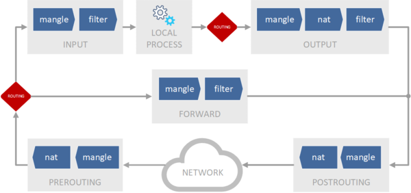

# 01.02. Network - iptables
iptables как брандмауэр - специализированное ПО для фильтрации сетевого трафика

## Структура или Таблицы -> Цепочки -> Правила
**Таблицы**
- raw: предназначена для обработки пакетов прежде, чем они будут переданы системе `conntrack`;
    - цепочки: PREROUTING и OUTPUT.
- mangle: используется для модификации некоторых заголовков (TTL, TOS) и маркировке пакетов и соединений
    - цепочки: PREROUTING, INPUT, FORWARD, OUTPUT и POSTROUTING.
- nat: предназначен для преобразования адресов и портов источника и назначения пакетов;
    - цепочки: PREROUTING, OUTPUT, POSTROUTING.
- filter: применяется, собственно, для фильтрации пакетов, является таблицей по умолчанию, т.е. если таблица не указана явно, то используется filter;
    - цепочки INPUT, FORWARD и OUTPUT.
- security: используется для работы совместно с системами принудительного контроля доступа, такими как SELinux.
    - цепочки INPUT, FORWARD, OUTPUT.

**Цепочки**  
Встроенные:
- PREROUTING: используется для всего входящего трафика до принятия первого решения о маршрутизации
- INPUT: применяется для входящего трафика текущего узла
- FORWARD: через нее проходит транзитный трафик узла
- OUTPUT: применятся для исходящего трафика текущего узла
- POSTROUTING: используется для всего исходящего трафика после принятия всех решений о маршрутизации
  Пользовательские:
- создаются непосредственно пользователями и могут применяться для построения сложных конфигураций обработки трафика.

Со старта все цепочки пустые, но с действием по умолчанию (ACCEPT), которое будет применено к пакету, если он прошел всю цепочку и не попал под действие ни одного правила.

**Правила**  
Состоит из:
- критерия: логическое условие, правило сработает если удовлетворяет **всем** критериям. Если не указан, срабатывает ко всем пакетам;
    - различные свойства пакетов и/или соединений,
    - наиболее часто используются интерфейсы,
    - IP-адреса источника и назначения,
    - порты.
    - Также перед критерием может стоять знак отрицания - !, в этом случае критерий объединяется при помощи логического И-НЕ.
- действия: которое нужно применить к пакету;
    - Виды
        - Общие:
            - ACCEPT: пропускает пакет
            - DROP: блокирует пакет, **не** сообщает источнику об отказе. Прим.: Чаще всего используют для блокировки внешних пакетов, чтобы не давать потенциальному злоумышленнику лишней информации о работе сети.
            - REJECT: блокирует пакет, сообщает источнику об отказе
        - Таблицезависимые:
            - mangle: MARK
                - используется в таблице mangle,
            - NAT:
                - MASQUERADE: проброс без изменения?
                - SNAT: Source Network Address Translation - изменение адреса и порта источника пакета, доступен в цепочке POSTROUTING
                - DNAT: Destination Network Address Translation - изменение адреса и порта назначения пакета, доступен в цепочках PREROUTING и OUTPUT
    - Типы:
        - Терминальные: действия прекращают прохождение пакета по цепочке, к ним относятся все специфичные действия для таблиц filter и nat
        - нетерминальными: действия специфичные для таблицы mangle.
- счетчика: учитывается количество примененных действий, считает количество пакетов и их размер в байтах.

Попав в цепочку пакет последовательно проходит правила в порядке их перечисления до первого срабатывания.  
Дальнейшее его движение зависит от типа действия, если действие нетерминальное - пакет продолжит движение по цепочке, иначе - покидает ее.

##### Порядок прохождения пакетов через брандмауэр
Правила разных таблиц, но одинаковых цепочек могут идти вперемешку, но выполняться они все равно будут в последовательности таблица - цепочка - набор правил.  
Одноименные цепочки таблиц проходятся последовательно.

**Транзитивный трафик**  
Транзитивный трафик проходит через PREROUTING -> FORWARD -> POSTROUTING. Он никогда не попадает в цепочки INPUT и OUTPUT, а преобразование адреса назначения (DNAT) выполняется перед фильтрацией.  
**Локальный трафик**  
Делится на входящий (до INPUT) и исходящий (OUTPUT и далее).  
Локальный трафик проходит через PREROUTING -> INPUT -> LOCAL PROCESS -> OUTPUT -> POSTROUTING. Он никогда не попадет в FORWARD.  
Если нам нужно выполнить преобразование адреса назначения (DNAT) для локального пакета, то мы должны сделать это в цепочке OUTPUT, потому что в PREROUTING такой пакет никогда не попадет.

##### Синтаксис критериев
**Универсальные**
- -A, добавляет новое правило в конец указанной цепочки.
- -D, ?
- -t, указание таблицы
- -j, указание действия
- -i, --in-interface имя_интерфейса - определяет входящий сетевой интерфейс, можно использовать префикс через + (ppp+).
- -o, --out-interface имя_интерфейса - определяет исходящий сетевой интерфейс, по синтаксису аналогичен критерию -i.
- -s, --src, --source адрес[/маска] ,адрес[/маска]... - определяет адрес отправителя пакета,
    - Указать можно
        - IP-адрес;
        - подсеть (в формате адрес/маска);
        - в качестве имени из /etc/hosts;
        - DNS-имени.
    - Особенности:
        - В случае с DNS-именем, имя будет разрешено в адрес в момент добавления правила. На практике не рекомендуется использовать эту возможность, так как на момент применения правил служба DNS может оказаться недоступной.
        - Начиная с версии 1.4.6 iptables позволяет указывать несколько значений адресов источников, разделяя их запятыми (логическое ИЛИ).
        - Комбинаторно добавляет записи при указании нескольких критериев.
- -d, --dst, --destination адрес[/маска], адрес[/маска]... - определяет адрес получателя пакета, синтаксис аналогичен -s.
- -p, --protocol протокол - определяет протокол транспортного уровня,
    - Можно указать номер либо наименование протокола в том виде, в котором они приведены в /etc/protocols.
    - пример: `iptables -A INPUT -i ens33 -p tcp -j ACCEPT`
    - пример: `iptables -A INPUT -i ens33 -p 6 -j ACCEPT`

**Cпецифичные для протоколов и требующие подключения внешних модулей.**  
**tcp**
- --sport, --source-port порт[:порт] - указывает порт или диапазон портов источника.
    - `iptables -A INPUT -s 192.168.2.0/24 -p tcp --dport 62000:62200 -j ACCEPT`
- --dport, --destination-port порт[:порт] - аналогично, но для порта или диапазона портов назначения.
    - `iptables -A FORWARD -o ens34 -p udp --dport 53 -s 192.168.2.0/24 -d 8.8.8.8 -j REJECT`
- -m - если нужно указать несколько портов, внешний модуль multiport.
    -  --sports, --source-ports, аналогично выше
    - --dports, --destination-ports, аналогично выше
    - `iptables -A INPUT -s 192.168.2.0/24 -p tcp -m multiport --dports 80, 443 -j ACCEPT`
- --tcp-flags, для проверки TCP-флагов пакета
- --icmp-type, определяющий тип ICMP пакета
    - `iptables -I INPUT -p icmp --icmp-type echo-request -j ACCEPT`, разрешит только эхо-запросы (пинги)
- iprange
    - --src-range, задают диапазон адресов источника
    - --dst-range, аналогично назначения
- mac
    - --mac-source, задает MAC-адрес источника.
- conntrack: внешний модуль, позволяющий контролировать состояние соединения
    - --ctstate, позволяет отслеживать состояние соединения
        - NEW - пакет является первым в соединении, соединение еще не установлено.
        - ESTABLISHED - пакет относится к уже установленному соединению.
        - RELATED - первый пакет для соединения связанного с уже установленным, например, открытие канала передачи данных для FTP.
        - INVALID - пакет, не принадлежащий ни одному соединению в системе и не являющийся первым пакетом соединения.
        - DNAT - соединение подверглось операции подмены адреса назначения
        - SNAT - соединение подверглось операции подмены адреса источника

Существует два варианта настройки брандмауэра: нормально открытый (разрешено все, что не запрещено) и нормально закрытый (запрещено все, что не разрешено).  
Нормально открытый брандмауэр обычно используется только со стороны доверенных сетей, во всех остальных случаях следует использовать нормально закрытый брандмауэр.

##### Оптимизация правил
- Разрешать пакеты, если соединение уже было установлено
    - `iptables -A INPUT -i ens33 -m conntrack --ctstate ESTABLISHED,RELATED -j ACCEPT`
    - Все относящиеся к установленным соединениям пакеты будут пропускаться этим правилом, без предварительных проверок, также сразу снимется проблема связанных соединений, они также будут разрешаться автоматически
- Отбрасывать все не принадлежащие существующим соединениям пакеты.
    - `iptables -A INPUT -i ens33 -m conntrack --ctstate INVALID -j DROP`
- проброс портов \ Port forwarding
    - `iptables -A FORWARD -i ens33 -o ens34 -d 192.168.2.220, 192.168.2.221 -p tcp --dport 3389`
    - Если мы делаем проброс с изменением номера порта, для 192.168.2.220 3389 -> 3389, а для 192.168.2.221 3390 -> 3389, то в обоих правилах мы должны будем указать один и тот же порт - порт назначение, т.е. 3389:


##### Базовый каркас
```Bash
#Разрешаем уже установленные и связанные соединения
iptables -A INPUT -i ens33 -m conntrack --ctstate ESTABLISHED,RELATED -j ACCEPT

#Разрешаем входящий SSH
iptables -A INPUT -i ens33 -p tcp --dport 22 -m conntrack --ctstate NEW -j ACCEPT

#Запрещаем остальные входящие соединения
iptables -A INPUT -i ens33 -j DROP

#Разрешаем уже установленные и связанные транзитные соединения  WAN -> LAN
iptables -A FORWARD -i ens33 -o ens34 -m conntrack --ctstate ESTABLISHED,RELATED -j ACCEPT

#Запрещаем остальные транзитные соединения WAN -> LAN
iptables -A FORWARD -i ens33 -o ens34 -j DROP
```
Принципы:
- все правила, относящиеся к одной цепочке, должны быть записаны рядом,
- Правила описывающие более частные случаи должны располагаться выше более общих
- всегда обращайте внимание на последнее действие в цепочке и действие по умолчанию.
- если вы не понимаете, что делает то или иное правило - оно вам не нужно.


##### Разбор примера
```Kotlin
// ToDo: Расписать текущие настройки в /etc/network/interfaces для хоста и дочерней ВМ
```
```Bash
auto lo
iface lo inet loopback

iface enp6s0 inet manual

auto vmbro
iface vmbro inet static
  address 192.168.174.100/24
  gateway 192.168.174.1
  bridge-ports enp6s0
  bridge-stp off 
  bridge-fd 0
#External Web - Host Server network
auto vmbr100
iface vmbr100 inet static
  address 192.168.100.1/24
  bridge-ports none 
  bridge-stp off 
  bridge-fd 0
  post-up echo 1 › /proc/sys/net/ipv4/ip_forward
  post-up iptables -t nat -A POSTROUTING -s '192.168.100.1/24' -o vmbro -j MASQUERADE
  post-down iptables -t nat -D POSTROUTING -s '192.168.100.1/24'-o vmbro -j MASQUERADE
  post-up iptables -t raw -I PREROUTING -i fwbrt -j CT -- zone 1 
  post-down iptables -t raw -D PREROUTING -i fwbrt -j CT -- zone 1
#NAT - VMS
source /etc/network/interfaces.d/*
```

- `auto lo`
  - 
- `iface lo inet loopback`
  - 
- `iface enp6s0 inet manual`
- `auto vmbro`
- `iface vmbro inet static `
- `address 192.168.174.100/24`
- `gateway 192.168.174.1 `
- `bridge-ports enp6s0 `
- `bridge-stp off `
- `bridge-fd 0`
- `post-up echo 1 › /proc/sys/net/ipv4/ip_forward`
    - post-up:
- `post-up iptables -t nat -A POSTROUTING -s '192.168.100.1/24' -o vmbro -j MASQUERADE`
    - post-up:
    - iptables: добавляет правило в iptables
    - -t nat: добавить правило в таблицу nat
    - -A POSTROUTING: добавить правило в начало цепочки POSTROUTING
    - -s '192.168.100.1/24: для всех ип адресов из диапазона 192.168.100.1/24
    - -o vmbro: для исходящего сетевого интерфейса vmbro
    - -j MASQUERADE: выполнить маскарадинг
- `post-down iptables -t nat -D POSTROUTING -s '192.168.100.1/24'-o vmbro -j MASQUERADE`
    - post-down:
    - iptables: добавляет правило в iptables
    - -t nat: добавить правило в таблицу nat
    - -D POSTROUTING: удалить правило из цепочки
    - -s '192.168.100.1/24: для всех ип адресов из диапазона 192.168.100.1/24
    - -o vmbro: для исходящего сетевого интерфейса vmbro
    - -j MASQUERADE: выполнить маскарадинг
- `post-up iptables -t raw -I PREROUTING -i fwbrt -j CT -- zone 1`
    - post-up:
    - iptables: добавляет правило в iptables
    - -t raw: добавляет правило в таблицу raw
    - -I PREROUTING: вставить последним? в цепочку PREROUTING
    - -i fwbrt: для входящего сетевой интерфейса fwbrt
    - -j CT: выполнить действие CT CT:
        - Операция установки значения conntrack zone. Механизма, позволяющего корректно отслеживать соединения в случае подключения хоста к двум или более сетям с одинаковыми адресными пространствами через разные сетевые интерфейсы
    - -- zone 1: ?
- `post-down iptables -t raw -D PREROUTING -i fwbrt -j CT -- zone 1`
    - post-down:
    - iptables: добавляет правило в iptables
    - -t raw: добавляет правило в таблицу raw
    - -D PREROUTING: удалить правило из цепочки
    - -i fwbrt: для входящего сетевой интерфейса fwbrt
    - -j CT: выполнить действие CT ?
    - -- zone 1: ?

## NAT
```Bash 
# Включить NAT
iptables -t nat -A POSTROUTING -o ppp0 -j MASQUERADE
```
где ppp0 название вашего интерфейса через который выходите в интернет.
