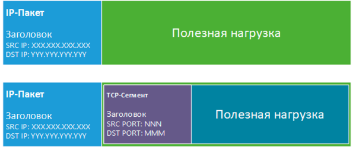
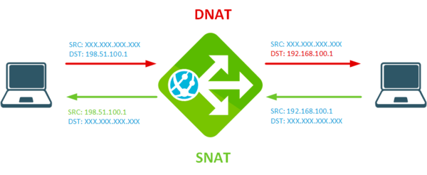

# 01.02. Network - NAT
Для использования в локальных сетях используются диапазоны частных или т.н. "серых" IP-адресов, их особенностью является то, что они не маршрутизируются в интернете, т.е. если маршрутизатору попадает такой пакет и для него нет отдельного маршрута - он будет отброшен.  
Определение - механизм по преобразованию IP-адресов транзитных пакетов. Позволяет использовать нескольким сетевым устройствам один сетевой адрес.
IP порт содержит:
- SRC IP, DST IP
- Полезная нагрузка
    - Порт в пакете идет нагрузкой в заголовке сегмента протокола (tcp, udp..).
      

Виртуальные маршрутизаторы:
- Unix: iptables
- OS: Pfsense, [VyOS](https://habr.com/ru/articles/435568/), CHR

```Bash 
# Включить NAT в iptables
iptables -t nat -A POSTROUTING -o ppp0 -j MASQUERADE
```
где ppp0 название интерфейса через который приосходит выход в интернет.

## Виды
- симметричный (SNAT): все порты внутреннего адреса транслируются на порты внешнего адреса, при этом устройство становится полностью доступным из внешней сети.
- динамический (DNAT): порт внутреннего адреса случайным образом транслируется на порт одного из внешних адресов, причем для каждого нового соединения может быть использован отличающийся адрес.
- перегруженный (маскарадинг / MASQUERADE): порты нескольких внутренних адресов транслируются на случайные порты единственного внешнего адреса.

### DNAT - на входе, SNAT - на выходе.
Все преобразования NAT выполняются либо до, либо после принятия решения о маршрутизации и фильтрации трафика брандмауэром, этот момент следует учитывать при построении правил фильтрации.  


### SNAT
Заменяет адрес источника пакета внешним адресом, также, при необходимости, меняет и порт источника, что позволяет различать запросы, сделанные с одного и того же порта разных ПК (таблица трансляций).  
Общий вид записи:
- `iptables -t nat -A POSTROUTING -o ens33 -j SNAT --to-source 198.51.100.1`
    - изменять адрес источника для всех исходящих пакетов;
    - -t nat, добавить правило в таблицу nat
    - -A POSTROUTING, добавить правило в начало цепочки POSTROUTING
    - -o ens33, для всех пакетов с внешним интерфейсом ens33
    - --to-source, адрес, присваиваемому пакету. (теперь именно этот адрес будет указываться в качестве исходящего).
- `iptables -t nat -A POSTROUTING -o ens33 -s 192.168.100.0/24 -j SNAT --to-source 198.51.100.1`
    - изменять адрес источника для исходящих пакетов из подсети 192.168.100.0/24;

### MASQUERADE (маскарадинг)
Типичная запись: `iptables -t nat -A POSTROUTING -o ens33 -s 192.168.100.0/24 -j MASQUERADE`  
Когда использовать MASQUERADE?
- удобен для использования если на внешнем интерфейсе используется динамический IP-адрес;
- при остановке интерфейса таблица трансляций полностью очищается и все текущие соединения разрываются;

##### Отличие SNAT от MASQUERADE
`iptables -t nat -A POSTROUTING -o ens33 -s 192.168.100.0/24 -p tcp --dport22 -j SNAT --to-source 198.51.100.1:2222
iptables -t nat -A POSTROUTING -o ens33 -s 192.168.100.0/24 -p tcp --dport22 -j MASQUERADE --to-ports 2222`
- Оба этих действия позволяют явно указывать исходящий порт или диапазон портов для трансляции,
    - для SNAT это делается в параметре **--to-source** через двоеточие
    - в MASQUERADE используется специальная опция **--to-ports**
- действие MASQUERADE дает более высокую нагрузку на систему, так как определяет адрес внешнего интерфейса для каждого пакета.
- Если в сети статический адрес, то предпочтительнее использовать SNAT.

### DNAT
- применяется в основном для проброса портов
- должен быть указан входящий интерфейс (как в правиле ниже) или адрес этого интерфейса, в противном случае преобразованию будут подвергаться все пакеты, в том числе и проходящие из внутренней сети наружу.
- REDIRECT: это действие позволяет перенаправлять пакеты на другой порт текущего узла.
    - `iptables -t nat -A PREROUTING -i ens34 -p udp --dport 53 -j REDIRECT --to-ports 53`
    - перехватим все DNS-запросы и направим их локальному DNS-серверу, развернутому на этом же узле
- `iptables -t nat -A PREROUTING -i ens33 -p tcp --dport 3389 -j DNAT --to-destination 192.168.100.1`
    - Данное правило изменит адрес назначения всех пакетов пришедших на внешний интерфейс ens33 по протоколу tcp с портом назначения TCP-сегмента 3389 на адрес внутреннего сервера 192.168.100.1.
- `iptables -t nat -A PREROUTING -i ens33 -p tcp --dport 3390 -j DNAT --to-destination 192.168.100.1:3389`
    - если используется нестандартный порт