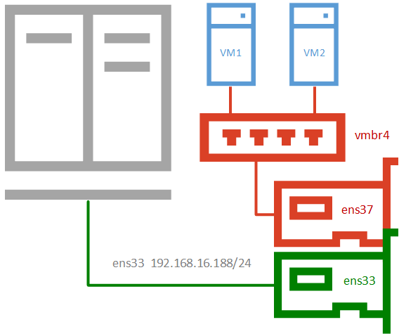
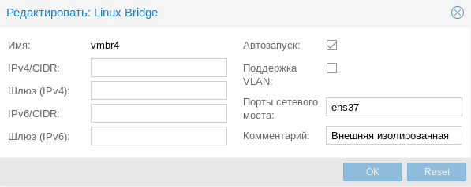
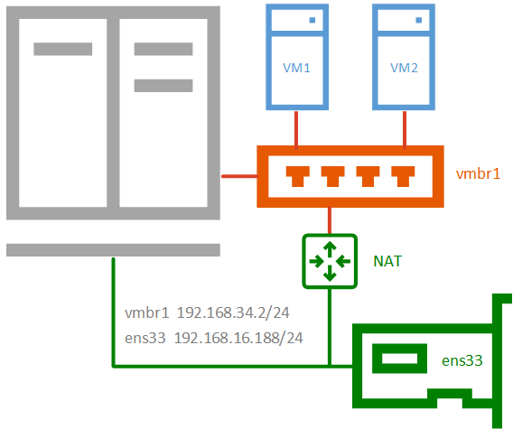
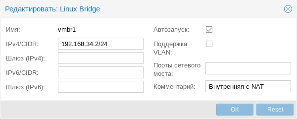
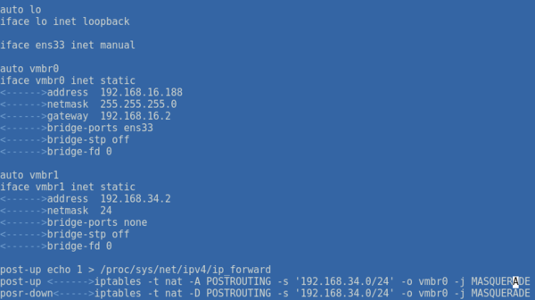
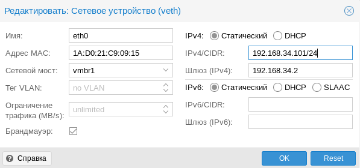
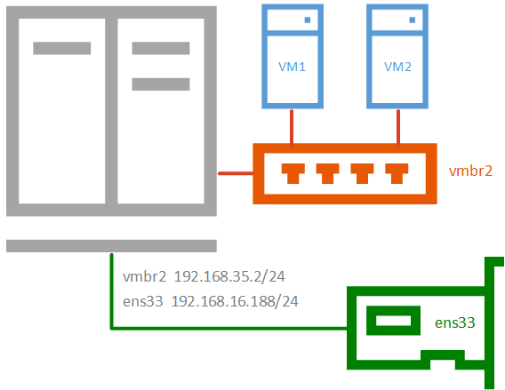
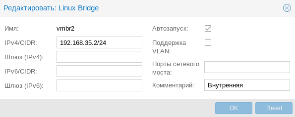
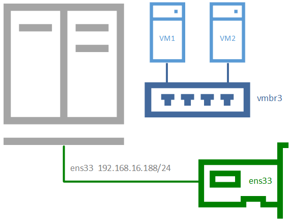
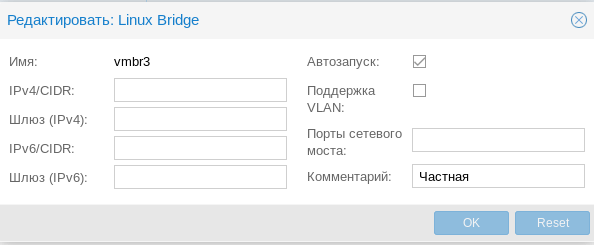

# 01_04 Network - Базовые типы сетей для гипервизора

## Внешняя сеть
Сетевая конфигурация, когда и ВМ, и гипервизор получают прозрачный доступ к вешней сети, подключенной через физический сетевой адаптер. Мост выступает неуправляемым коммутатором.
Доступ к ВМ, как к самым обычным узлам локальной сети. DHCP сервером выступает внешняя сущность. Все сетевые настройки производятся внутри виртуальных машин.


### Настройка в Proxmox
#### System - Network (host)
В Proxmox для подключения гипервизора к сети на хосте следует назначить IP-адрес интерфейсу моста, также в настройках указывается CDR, шлюз, опция автозапуска и привязанный к мосту физический адаптер (!!!).
В Hyper-V создавался еще один виртуальный сетевой адаптер.


#### System - DNS
DNS сервером указывается шлюз.

### VM - Hardware - Network
Для подключения ВМ к такому мосту достаточно ее выбрать. (vmbr0)

## Внешняя изолированная сеть
Позволяет изолировать гипервизор от внешней сети и виртуальных машин. Используется при виртуализации пограничных устройства, например, шлюза.  
Либо когда виртуальные машины арендуются третьими лицами, либо находятся вне доверенной сети и доступ к гипервизору оттуда должен быть закрыт.


### Настройка в Proxmox
#### System - Network (host)
Нужно создать новый сетевой мост без сетевых настроек и привязать к нему физический адаптер (тоже без настроек), так будет обеспечен доступ виртуальных машин во внешнюю сеть с изоляцией этой сети от гипервизора.
Для доступа к самому гипервизору может быть использован либо другой сетевой адаптер (на схеме), так и созданная по умолчанию внешняя сеть с сетевым мостом.


## Внутренняя сеть с NAT
Применяется в тех случаях, когда нужно изолировать виртуальные машины в собственной сети, но также обеспечить им доступ в интернет и доступ из внешней сети к некоторым из них (или отдельным сетевым службам).  
Широко используется в лабораторных сценариях, а также при работе с **контейнерами**. Данная конфигурация не может быть изолирована от хоста, так как именно хост предоставляет ей службу трансляции сетевых адресов (NAT) и выступает шлюзом для виртуальных машин


### Настройка в Proxmox
#### System - Network (host)
Для настройки такой сети создайте новый сетевой мост без привязки к физическому адаптеру и назначьте ему IP-адрес из произвольной сети, отличной от внешней.


В `/etc/network/interfaces` следует добавить правила перенаправляющие трафик с моста на сетевой интерфейс.
```Bash
post-up echo 1 > /proc/sys/net/ipv4/ip_forward
post-up   iptables -t nat -A POSTROUTING -s '192.168.34.0/24' -o ens33 -j MASQUERADE
post-down iptables -t nat -D POSTROUTING -s '192.168.34.0/24' -o ens33 -j MASQUERADE
```
В качестве сети вместо (192.168.34.0/24), укажите выбранную вами сеть, а вместо интерфейса ens33 укажите тот сетевой интерфейс, который смотрит во внешнюю сеть с доступом в интернет.  
Если вы используете сетевую конфигурацию по умолчанию, то это будет не физический адаптер, а первый созданный мост vmbr0.  
Итоговый вывод `/etc/network/interfaces`


#### System - DNS
DNS сервером указывается шлюз.

### VM - Hardware - Network
Назначим виртуальной машине или контейнеру созданную сеть (vmbr1), также выдадим ей адрес из этой сети, а шлюзом **укажем адрес моста.**


## Внутренняя сеть
Позволяет изолировать виртуальные машины от внешней сети и не предоставляет им доступ в интернет, используется в основном в лабораторных целях.  
Когда в качестве шлюза выступает одна из виртуальных машин и обычно сочетается на хосте с одной из сетей, имеющих выход в интернет.


### Настройка в Proxmox
#### System - Network (host)
Чтобы получить такую сеть, просто создайте еще один мост без привязки к адаптеру и назначьте ему IP-адрес из любой отличной от используемых сети.


## Частная сеть
Разновидность внутренней сети, которая подразумевает изоляцию не только от внешней сети, но и от хоста.  
Что позволяет получить полностью независимую сеть между виртуальными машинами, может быть полезна в лабораторных условиях.  
Когда нужно смоделировать сеть, адресация которой пересекается с используемыми вами сетями.


### Настройка в Proxmox
#### System - Network (host)
Для такой сети просто создайте еще один сетевой мост без каких-либо настроек.


## Ссылки
- [Настраиваем сеть в Proxmox Virtual Environment](https://interface31.ru/tech_it/2019/10/nastraivaem-set-v-proxmox-ve.html)