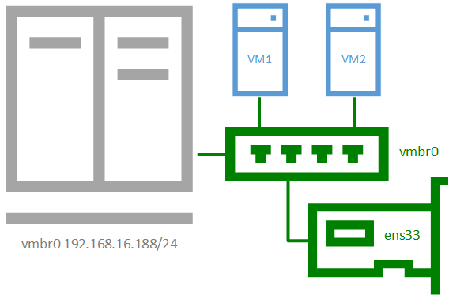

# 01_Operation_Systems Summary

## Глоссарий
- ВМ: sandbox окружение, в котором эмулируется или прокидывается железное оборудование (диск, видеокарта, флешка, звук и т.п).  
- Гипервизор: ПО для запуска нескольких ВМ на одной физической машине
- X - Server: графическое окружение (GUI) для Unix 
- GRUB / UEFI: графическая оболочка над BIOS
- NAT: Network Address Translation использование адреса одного сервера для нескольких виртуальных машин
- Протокол IP: маршрутизируемый протокол сетевого уровня (L3), предназначенный для передачи данных между сетями. Единицей передачи данных на уровне IP-протокола является пакет.
- Сетевой мост (bridge) - При работе в режиме сетевого моста виртуальные машины будут находиться в одной подсети с гипервизором и использовать IP-адреса этой подсети.
- conntrack система отслеживания состояния соединений и принадлежностью пакетов этим соединениям
- MASQUERADE: (маскарадинг) iptables action in nat table, algorithm that allows one to route traffic without disrupting the original traffic. Маскарадинг самостоятельно получает IP-адрес от заданного сетевого интерфейса и не требует его явного указания.
- DNS: Domain Name System, преобразует доменные имена, удобные для человеческого восприятия (например, www.amazon.com), в IP-адреса, понимаемые машиной (например, 192.0.2.44).

## Теория

### Чем различаются дистрибутивы Linux
Различия:
- Глобальные
  - цели (десктоп, Server, IOT, Cloud)
  - надежность / стабильность (LTS)
- Технические
  - с привязкой к железу или переносимые
  - версия ядра (systemd у Debian / Ubuntu,)
  - пакеты (RPM-пакеты, DPK-пакеты)
  - X - сервер (Gnome ,KDE, Cinnamon и т.п)

### Образ или ВМ
Образ - слепок диска, позволяющий совершать какие-либо действия. Как просто установку из него, так и полноценную работу.
ВМ - слепок диска, как правило с установленной ОС.

### VirtualBox, VMWare, Parallels, vagrant, QEMU
- VirtualBox: open source Desktop решение для виртуализации.
- VMWare: corporate Desktop решение для виртуализациии.
- Parallels: corporate Desktop решение для виртуализациии.
- QEMU: open source Desktop решение для виртуализации.

## 1. Базовая установка

### 1.1 Установка Debian 
Решил взять Proxmox, чтобы сразу привыкать к кластерам и не устанавливать ручками с флешки (навыком накатывания флешки из образов обладаю), внутри у него Debian. 

#### Установка Proxmox
Proxmox Virtual Environment - open source платформа виртуализации на основе гипервизора KVM.
- [Домашний сервер на базе Proxmox](https://habr.com/ru/companies/banki/articles/827760/)
- CE скрипты после установки [старое](https://github.com/tteck/Proxmox?tab=readme-ov-file) -> [новое](https://github.com/community-scripts/ProxmoxVE/blob/main/misc/post-pve-install.sh)

##### Загрузка образов в Proxmox


##### Настройка сети в Proxmox
Решил настроить сеть между хостом и дочерними ВМ в режиме сетевого моста (bridge). ВМ и Хост будут в одной подсети и использовать IP-адреса этой подсети т.н [внешняя сеть](https://interface31.ru/tech_it/2019/10/nastraivaem-set-v-proxmox-ve.html).  
DHCP / DNS сервером выступает сетевой маршрутизатор. Во всех случаях нужно учесть, что порты открыты на роутерах / хосте / сетевых брандмауерах.


###### Хост
Рабочий вывод после `nano /etc/network/interfaces`
```
auto lo
iface lo inet loopback

auto enp6s0
iface enp6s0 inet dhcp # Позволяет получить ip динамически

auto vmbr0
iface vmbr0 inet static            # Сетевой мост
        address 192.168.174.100/24 # ip адресс выдан статически на маршрутизаторе
        gateway 192.168.174.1      # Локальный адрес домашнего сетевого маршрутизатора
        bridge-ports enp6s0        # через какой сетевой интерфейс выход в интернет (ethernet / RJ-45)
        bridge-stp off
        bridge-fd 0
# Host external network

source /etc/network/interfaces.d/*
```
Рабочий вывод после `nano /etc/resolv.conf` -
```
domain fritz.box
search fritz.box
nameserver 192.168.174.1 # Локальный адрес домашнего сетевого маршрутизатора
```
Рабочий вывод после `iptables -t nat -L`: пустая таблица.

###### Дочерняя VM
- Network Device: Intel E1000
```
source /etc/network/interfaces.d/*
auto lo
iface lo inet loopback

#Primary network interface
auto ens18
iface ens18 inet static
        address 192.168.174.2
        gateway 192.168.174.1
```

### 1.2 Создание n ВМ
- Из дистрибутивов взял Debian 12 из образа. 
- На основе образа завел 3 виртуалки под QEMU, специально не стал клонировать, а именно через Create VM.
- Нейминг VM: n.child.debian
- Каждую вручную установил через Graphical install.
- По-дефолту завел пользователя root и kirillkonovalov.
- Отключил X-Server: `systemctl set-default multi-user.target`
  - для включения: `systemctl set-default graphical.target`

### Ручное добавление пункта меню в Grub (dualboot)
**Простой путь**
- `nano /etc/default/grub`: конфиг grub
- `GRUB_DISABLE_OS_PROBER=false`: включаем os-prober
- `update-grub2`: обновляем конфиг grub
**Сложный путь**
- `fdisk -l`: Выводит список партиций, нужно искать или грепнуть по Type = EFI.
  - найти его путь вида `/dev/sda2` или `/dev/nvme0n1p1`
- `blkid /dev/nvme0n1p1`: вывести UUID (например 3C26-6A4C)
- `lsblk -no uuid /dev/nvme0n1p1`: вывести только UUID
- `chmod o+w 40_custom`: опционально дать доступ на запись
- `chmod o-w 40_custom`: убрать доступ на запись
- `nano /etc/grub.d/40_custom`: открыть на запись template
- добавить:
  - ```
    menuentry 'Windows' {
      search.fs_uuid $uuid
      chainloader /EFI/Microsoft/Boot/bootmgfw.efi
    }```
  - где uuid, это ид партиции с efi
  - или ```
    menuentry 'Windows 11' {
      search --fs-uuid --no-floppy --set=root 3C26-6A4C
      chainloader (${root})/EFI/Microsoft/Boot/bootmgfw.efi
    }```
- `update-grub2`: обновить конфиг или
- `grub-mkconfig -o /boot/grub/grub.cfg`: вручную создать конфиг из template и записать в текущий

## 2. Создание пользователя, добавление / убавление прав пользователей
Одной из ключевых характеристик Linux является ее многопользовательская архитектура. Это означает, что на одном компьютере может существовать множество учетных записей.  
Каждая из них имеет свое собственное рабочее пространство, настройки и ресурсы. Благодаря этому пользователи получают возможность работать на одной машине одновременно, изолируя свои данные и деятельность друг от друга.  

### Пользователь / группа

#### Типы пользователей
- Суперпользователь - неограниченные права (UID и GID у него равны специальному значению 0).
- Обычный пользователь - права с ограничениями, установленными для него суперпользователем. Имеют права на доступ в рамках своего идентификатора (UID, userid) и членства в группе (GID, group ID).
- Специальный пользователь - права с ограничениями, установленными ему суперпользователем для работы с конкретным приложением. Обычно различные системны службы.
- Псевдопользователь - нет никаких прав, он вообще не идентифицируется системой

#### Свойства пользователя
`account:password:UID:GID:GECOS:directory:shell`

- account — имя пользователя. Это поле не может быть пустым. Применяются стандартные для *NIX правила именования.
- password — пароль пользователя (или shadow пароль).
- UID — численное значение идентификатора пользователя. Нумерация обычных пользователей (отличных от root) обычно начинается с UID 100.
- GID — численное значение идентификатора основной группы пользователя. Идентификаторы групп можно найти в файле `/etc/group`.
- GECOS — необязательное поле, носящее информативный характер; обычно содержит настоящее имя пользователя, но может также использоваться службами вроде finger и изменяться командой chfn. Поскольку поле необязательное, его можно оставить пустым.
- directory — используется командой входа для задания переменной окружения $HOME. Некоторые службы, для которых создаются специальные пользователи, используют для этого корневой каталог /, но обычные пользователи чаще всего хранят домашний каталог в разделе /home.
- shell — командная оболочка пользователя. Это поле является необязательным, и если в нём ничего не указано, то используется оболочка /bin/bash.

#### Изменение настроек по умолчанию для новых пользователей
- `useradd -D`: просмотр текущих дефолтных настроек
- `useradd -D -b /home/WorkingProject -s /bin/bash`: изменение рабочей директории

#### Создание / удаление обычного пользователя
Необходимым и достаточным условием "существования" пользователя в системе является его наличие в файле `/etc/passwd`.
- через команду `adduser username`
- создается папка `/etc/home/` или в другом месте если переопределено дефолтное место
- добавляется запись в `/etc/passwd` или `/etc/shadow` с кешом пароля
- `userdel username`: удаление пользователя 
  - -f — завершить все процессы пользователя и удалить насильно, даже если пользователь сейчас работает в системе; 
  - -r — удалить домашний каталог пользователя;

#### Создание суперпользователя
- при установке всегда создается суперпользователь c именем root
- Установить команду sudo:
  - su - 
  - apt-get install sudo -y
- чтобы предоставить обычному пользователю sudo-привилегии, его нужно добавить в группу sudo:
  - `usermod -aG sudo username`

#### Создание / удаление групп
Основные команды `groupadd`, `groupdel`, `groupmod`.
- gid — group id, номер группы.
- `cat /etc/group`: вывод существующих групп
- `groups пользователь`: вывод списка групп, в которых состоит пользователь
- `groupadd имя_группы`, `addgroup имя_группы`: создание группы
- `usermod -G имя_группы username`: добавление пользователя в группу
- `gpasswd -d пользователь группа`: удаление пользователя из группы ???
- `delgroup имя_группы`: удаление группы

#### Все есть файл
Каждый файл принадлежит какому-то пользователю и группе. Существует три типа прав доступа — чтение, запись и исполнение.

### Права пользователей
Чтобы получить доступ к файлам в Linux, используются разрешения. Эти разрешения назначаются трем объектам: файлу, группе и всем остальным.  
В Linux у каждого файла и каждого каталога есть два владельца: пользователь и группа.
Владелец -> группа -> права других пользователей (other).

#### Chown: смена владельца
- `chown кто что`: изменение владельца
  - `chown linda /home/account`: установить владельцем каталога пользователя linda
  - `chown -R linda /home/account`: установить владельца каталога и дочерних файлов / папок
- `chown .account /home/account`: Изменение владельца группы. Обязательно . или : перед названием группы.
  - `chown .sales myfile`:l устанавливает группу sales владельцем файла myfile без изменения владельца пользователя.
- ls -l: Эта команда показывает пользователя и группу-владельца.
- `find / -user linda`: получить список всех файлов в системе, в которых в качестве владельца указан данный пользователь или группа.
  - `find / -group users`: тоже самое, но для групп

#### Владелец по-умолчанию
Пользователь, который создает файл, автоматически становится владельцем этого файла, а основная группа этого пользователя автоматически становится владельцем этого файла.
Группа, которая ставится по-умолчанию, называется эффективная группа.  
- `groups lisa`: посмотреть группы, к которому причастен пользователь
- `newgrp sales`: сменить эффективную группу

#### Основные права
- чтение: файл != каталог
  - файл: чтение содержимого
  - каталог: позволяет видеть содержимое, но не позволяет читать файлы в каталоге
- запись: 
  - файл: изменять содержимое, но не создавать / менять права
  - каталог: создавать, удалять или задавать права
- выполнение: никогда не разрешено по умолчанию
  - файл: запустить файл как программу
  - каталог: перейти в каталог
- расширенные права: GUID, SUID, sticky bit (первый символ в 4х буквенном chmod)
  - SUID (4): разрешение на установку идентификатора пользователя
    - `chmod u+s`.
  - SGID (2): разрешения владельца группы на файл
    - `chmod g+s`.
    - пример: `chmod g+s somecatalog` все новые файлы в каталоге будут иметь группу каталога, а не пользователя.
  - GUID: идентификатор группы
  - sticky bit (1): защиты файлов от случайного удаления
- ACL: разрешения нескольким пользователям или группам в каталоге

#### chmod: Управление правами
При настройке разрешений рассчитывается необходимое значение для установки для user, group, other.
- Абсолютный режим: В абсолютном режиме три цифры используются для установки основных разрешений.
  - 4: Read
  - 2: Write
  - 1: Execute
- Относительный режим:
  - Можно установить сразу для всех пользователей: `chmod +x somefile`.
  - Либо для отдельных `chmod g+s somecatalog` или `chmod u+s somecatalog`

### Команды
- `su -l`: Start the shell as a login shell with an environment similar to a real login:
  - -l, --login
- `adduser user_01`
  - старая команда: `usradd`
  - useradd -D: просмотр текущих настреок пользователя
- `passwd user_01`: установка пароля пользователю. Без нее пользователь неактивен.
- `id username` получить инфу о пользователе
- `users` список пользователей
- Просмотр файла `/etc/passwd`, который содержит информацию о зарегистрированных в системе пользователях;
- `w`: подробный список активных юзеров, включая их имена, терминалы, активность (что они делают в данный момент), время входа и загруженность системы.
- `who` – показывает список активных пользователей, а также информацию о них;
- `last` – предоставляет историю входов пользователей, позволяя увидеть, когда и с каких устройств они входили в систему;
- `lastlog` – показывает информацию о последних входах пользователей, включая дату и время этих событий.
- `sed 's/:.*//' /etc/passwd`: список всех созданных пользователей
- `su - username`: переключение на пользователя
- для работы с дисками:
  - `df -h`: вывести информацию только о примонтированных файловых системах, включая те, которые не являются дисковыми разделами.
  - `lsblk`: выводит информацию о дисках и созданных на них разделах, их размерах, точке монтирования.
  - `blkid`: поиск или печать атрибутов диска
  - `parted -l`, `fdisk -l`: просмотреть размеры дисков и разделов.

#### Выполнение задания
1. Создай двух пользователей и общую папку между ними.
2. Оба пользователя должны уметь читать и писать в эту папку
   1. Под рутом:
      1. `groupadd admins`: добавить новую группу
      2. `adduser user_01`: добавить пользователя
      3. `passwd user_01`: и задать ему пароль
      4. `usermod -G admins user_01`: добавление пользователя в созданную группу
      5. `mkdir ./tmp/shared`: создаем общую папку
      6. `chown :admins shared`: делаем ей группу admins
      7. chmod 770 shared: даем права на выполнение
      8. chmod g+s shared: созданные файлы наследуют владельца каталога, а не пользователя
   2. Под пользователем:
      1. `newgrp admins`: сменить эффективную группу пользователя
      2. `touch file`: создаем файл в общей папке
      3. `chmod 660 file`: даем разрешение на запись всем в группе
   3. Повторить для другого пользователя

### 3.1 Работа с пакетным менеджером apt
Установи с помощью apt (mc, zsh, htop, btop, netstat, net-tools). 
- Установка: `apt-get install prog_name`.
- Переустановка: `apt-get reinstall prog_name` или `install --reinstall`
- Удаление: `apt-get remove` / `apt-get purge` (с config фалами)

#### mc
Midnight Commander: файловый менджер с текстовым интерфейсом.

#### Shell (Bourne again shell)
исполняемый файл: bash.
- Дефолт: оболочка есть в большинстве GNU/Linux дистро
- Лёгкая конфигурация и настройка: доступна в .bashrc в вашей домашней директории

##### Zsh (Z Shell)
- лучше автокомплит
- возможные значения после tab
- плагины
- темы

##### Fish «Friendly Interactive SHell»
- подсветка синтаксиса
- автоподсказки

#### atop, btop, htop: Контроль нагрузки процессоров
- top:
  - предустановлена во всех дистрибутивах Linux и не требует отдельной установки;
- htop: интерактивный
- atop: отличается возможностью ведения логов.

##### top
В верхней части выводится информация о системе, ниже — список процессов. Вывод обновляется каждые 2 секунды.  
Самые «жадные» до ресурсов процессы, оказывающие самую большую нагрузку на процессор, будут выведены вверху списка.

**Сведения о системе**
Слева вверху указано текущее время системы, далее:
- Up — время работы системы с последнего запуска.
- User — количество текущих пользователей.
- Load average — средняя нагрузка на сервер: отображаются значения за одну, пять и 15 минут назад.
- Tasks — общее количество запущенных процессов в разных статусах (running — выполняемые; sleeping — в ожидании; stopped — остановленные; zombie — «зомби», дочерние процессы, ожидающие завершения родительского процесса).
- Cpu(s) — процент времени процессора, затраченного на выполнение процессов, в том числе:
  - us — пользовательские процессы (высокое значение данного показателя может указывать, в том числе, на проблемы в коде сайта, необходимость его оптимизации);
  - sy — процессы ядра;
  - id — неиспользуемые ресурсы (чем выше этот показатель, тем лучше);
  - wa — операции ввода/вывода, т.е. дисковые операции.
- Mem, Swap — сведения об использовании оперативной памяти (total — общий объем, free — объем свободной памяти, used — объем использованной памяти).

**Сведения о процессах**
По умолчанию процессы выстроены в таблице по размеру нагрузки на процессор, от большего значения к меньшему. Обозначения столбцов:
- PID — идентификатор процесса;
- USER — пользователь, запустивший процесс;
- PR — приоритет процесса;
- NI — измененный приоритет (присвоенный пользователем с помощью команды nice);
- VIRT — объем используемой виртуальной памяти (здесь выводится тот объем памяти, который был запрошен процессом, даже если фактически используется меньше);
- RES — объем используемой оперативной памяти (в данном случае, если процесс запросил 50Мб памяти, а использует 10Мб, будет выведено 10Мб);
- SHR — объем памяти, разделяемой с другими процессами (т.е.  память, которая может быть использована другими процессами);
- S — статус процесса (running — запущен; sleeping — в ожидании; zombie — процесс-«зомби»);
- %CPU — процент использования процессорного времени;
- %MEM — процент использования оперативной памяти;
- TIME — общее время работы процесса;
- COMMAND — имя процесса (команда, которой был запущен процесс).

##### netstat / ss
Мониторинг сетевого сети: обзор сетевых соединений, таблиц маршрутизации, статистики интерфейсов и другой важной информации, связанной с сетью.
Часто используемые команды:
- -a: Показывает все прослушивающие порты и активные соединения
- -t: Отображает TCP-соединения
- -u: Показывает UDP-соединения
- -n: Показывает числовые адреса вместо разрешения хостов и портов
- -l: Показывает только прослушивающие сокеты
- -p: Отображает PID и имя программы
- -r: Показывает таблицу маршрутизации
- -i: Показывает статистику сетевых интерфейсов
- -s: Показывает статистику протоколов
- -c: непрерывное отображение (2 сек), комбинируетяс с другими командами (-ct) (но лучше через while с sleep)

### 3.2 Добавление репозитория (Debian)
В Debian каждый репозиторий состоит из нескольких веток (разделов):

- main ― эта ветка включается в каждый дистрибутив. Она подчиняется принципам свободного программного обеспечения. Ветка не зависит от других пакетов, которые не входят в раздел «main»;
- contrib ― эта ветка подчиняется принципам свободного ПО и зависит только от пакетов, которые не входят в раздел «main». Может понадобиться прошивка ROM или ПО, которое имеет собственника, например Java от Oracle;
- non-free ― содержит пакеты, которые противоречат принципам свободного программного обеспечения или имеют патенты и другие юридические ограничения.

При добавлении надо знать текущий релиз и архитектуру процессора.
- `cat /etc/os-release | grep VERSION_CODENAME`: узнаем версию ОС
- `$(dpkg --print-architecture)`: узнаем архитектуру процессора

- Некоторые репозитории защищены ключами GPG или pkp
- Отредактировать файл `/etc/apt/sources.list`
- В конец файла вставить команду с адресом репозитория:
  - deb ― указывает на то, что это пакет Debian;
  - ссылка на репозиторий пакетов Debian (выглядит, как обычный URL-адрес сайта). На сайте Debian есть ссылки на зеркала, а также список сгруппированных пакетов, по категориям Stable, Testing, Unstable;
  - название версии Debian ― кодовое имя дистрибутива, псевдоним (например, Buster ― Debian 10, Stretch ― Debian 9, Jessie ― Debian 8, и т.д);
  - main ― тип ПО (main, contrib, non-free)
  - пример: `deb https://packages.debian.org/buster/libc6 buster main`
- Вызвать `apt-get update` для обновления пакетов
- Удаление производится таким же образом

Альтернативные варианты добавления:
- Вставить строку в /etc/apt/sources.list (основной)
  - `deb [arch=amd64,arm64 signed-by=/usr/share/keyrings/elastic-7.x.gpg] https://artifacts.elastic.co/packages/7.x/apt stable main`
- Создание файла .list в sources.list.d
  - `echo "deb [arch=amd64,arm64 signed-by=/usr/share/keyrings/elastic-7.x.gpg] https://artifacts.elastic.co/packages/7.x/apt stable main" | sudo tee /etc/apt/sources.list.d/elastic-7.x.list > /dev/null`
- Создание файла .sources в sources.list.d
  - `/etc/apt/sources.list.d/elastic-7.x.sources`
  - содержание файла:
  ```
  Types: deb
  Architectures: amd64 arm64
  Signed-By: /usr/share/keyrings/elastic-7.x.gpg
  URIs: https://artifacts.elastic.co/packages/7.x/apt
  Suites: stable
  Components: main
  ```

#### Задание
- настрой репозиторий в apt не существующий по умолчанию (зависит от выбранной ОС)
- в целом изучи добавление / убавление репозиториев в apt

#### Выполнение (на примере Docker CE)
- нужно скачать GPG ключ
  - `sudo apt-get update` 
  - `sudo apt-get install ca-certificates curl`: ставим нужные зависимости
  - `sudo install -m 0755 -d /etc/apt/keyrings`: создаем хранилище ключей
  - `sudo curl -fsSL https://download.docker.com/linux/debian/gpg -o /etc/apt/keyrings/docker.asc`: скачиваем gpg ключ
  - `sudo chmod a+r /etc/apt/keyrings/docker.asc`: открываем на чтение всем
- `cat /etc/os-release | grep VERSION_CODENAME`: узнаем версию ОС
- `$(dpkg --print-architecture)`: узнаем архитектуру процессора
- Добавил репозиторий
- `echo "deb [arch=amd64 signed-by=/etc/apt/keyrings/docker.asc] https://download.docker.com/linux/debian bookworm stable" >> /etc/apt/sources.list`
  - deb: source использует обычную архитектуру Debian. 
  - arch=amd64,arm64: архитектуры, на которые будут загружены данные APT. Здесь это amd64 и arm64. 
  - signed-by=/etc/apt/keyrings/docker.asc: ключ, используемый для авторизации этого источника
  - https://download.docker.com/linux/debian: URI, репозитория 
  - /etc/apt/sources.list: хранилище данных о репозиториях
- `sudo apt-get update`: обновляем

## Вопросы к ментору
- Как размечать диски в Unix?
  - Предлагамая Схема разметки:
    1: Все файлы в одном разделе (рекомендуется новичкам) [*],
    2: Отдельный раздел для /home,
    3: Отдельные разделы для /home, /var u /tmp,
  - ExFat или ext4?
- Сеть
  - Какой тип сети используется для гипервизоров? сетевой мост?
  - VM генерирует рандомны MAC. А что если будут коллизии?
  - Как пробросить ВМ за NAT?
  - Почему мог поменяться физический адрес сетевого интерфейса? (enp6s0 -> enp112s0)
- Администрирование
  - Пароль от рута виртуалки один на все или всегда разный? Как провайдить / хранить пароли?
  - Зависимости:
    - После удаления все дерево зависимостей тоже удаляется?
    - К зависимости всегда держится его дерево? не переиспользуются существующие?
  - Почему мог не сработать os-prober после  `update-grub2` ? Пришлось вручную доавблять конфиг. Хотя `os-prober` видел партицию.
- Мониторинг
  - Что такое CPU Usage: Kernel?
  - Что используют чтобы дампить результаты htop?
  - Кроме CPU нужно смотреть еще RAM и свободное место? Чем? крона над df?
- 

## Полезные ссылки
- [Yandex Cloud Marketplace](https://yandex.cloud/ru/marketplace?categories=os&pageSize=75)
- [Что такое дистрибутив Linux](https://ruweb.net/articles/distributiv-linux-chto-eto)
- [В чем разница между дистрибутивами linux и какой выбрать?](https://qna.habr.com/q/192159)
- [Установка и первоначальная настройка Debian 11 для сервера](https://interface31.ru/tech_it/2022/08/linux-nachinayushhim-ustanovka-i-pervonachal-naya-nastroyka-debian-11-dlya-servera.html)
- Сеть
  - [Основы iptables для начинающих. Часть 1. Общие вопросы](https://interface31.ru/tech_it/2020/02/osnovy-iptables-dlya-nachinayushhih-chast-1.html)
  - [Основы iptables для начинающих. Часть 2. Таблица filter](https://interface31.ru/tech_it/2020/09/osnovy-iptables-dlya-nachinayushhih-chast-2-tablica-filter.html)
  - [Основы iptables для начинающих. Часть 3. Таблица nat](https://interface31.ru/tech_it/2021/07/osnovy-iptables-dlya-nachinayushhih-chast-3-tablica-nat.html)
  - [Основы iptables для начинающих. Часть 4. Таблица nat - типовые сценарии использования](https://interface31.ru/tech_it/2021/08/osnovy-iptables-dlya-nachinayushhih-chast-4-tablica-nat-tipovye-scenarii-ispolzovaniya.html)
- Proxmox
  - [Установка сети в Proxmox](https://help.reg.ru/support/vydelennyye-servery-i-dc/administrirovaniye-vydelennykh-serverov/ustanovka-i-nastroyka-seti-v-proxmox-ve#1)
  - [Настраиваем сеть в Proxmox](https://interface31.ru/tech_it/2019/10/nastraivaem-set-v-proxmox-ve.html)
- [Arch Linux | User and Groups](https://wiki.archlinux.org/title/Users_and_groups_(%D0%A0%D1%83%D1%81%D1%81%D0%BA%D0%B8%D0%B9))
- [Как посмотреть пользователей в Linux](https://timeweb.cloud/tutorials/linux/kak-posmotret-polzovatelej-v-linux)
- [Arch Linux | Группы](https://wiki.archlinux.org/title/Users_and_groups_(%D0%A0%D1%83%D1%81%D1%81%D0%BA%D0%B8%D0%B9)#%D0%A1%D0%BF%D0%B8%D1%81%D0%BE%D0%BA_%D0%B3%D1%80%D1%83%D0%BF%D0%BF)
- [Habr | Права в Linux](https://habr.com/ru/articles/469667/)
- [Общие папки Linux](https://losst.pro/obshhie-papki-linux)
- [О разных командных оболочках Linux и Unix](https://habr.com/ru/articles/157283/)
- [How to disable X server autostart in Debian Jessie?](https://unix.stackexchange.com/questions/264393/how-to-disable-x-server-autostart-in-debian-jessie)
- [htop и многое другое на пальцах](https://habr.com/ru/articles/316806/)
- [Контроль нагрузки и процессов: top, htop, atop](https://timeweb.cloud/docs/unix-guides/troubleshooting-unix/load-and-process-control-top-htop-atop)
- [Как добавить официальный репозиторий в Debian](https://help.reg.ru/support/servery-vps/oblachnyye-servery/ustanovka-programmnogo-obespecheniya/debian-repozitorii#3)
- [Solution to os-prober not finding other operating systems (Windows & Linux)](https://www.umutsagir.com/solution-to-os-prober-not-finding-other-operating-systems-windows-linux/)
- [How can I add Windows 11 to grub menu?](https://askubuntu.com/questions/1425637/how-can-i-add-windows-11-to-grub-menu)
- [Grub/os-prober problems with dual booting windows and arch](https://bbs.archlinux.org/viewtopic.php?id=283411)
- [Команда Linux blkid](https://linuxcookbook.ru/articles/komanda-linux-blkid)
- [Данные о дисках: df, lsblk, parted, fdisk](https://timeweb.cloud/docs/unix-guides/troubleshooting-unix/disk-data-df-lsblk-parted-fdisk)
- [Сторонние репозитории для Debian Stable](https://vk.com/@-53008948-storonnie-repozitorii-dlya-debian-stable)
- [Install Docker using the apt repository](https://docs.docker.com/engine/install/debian/#install-using-the-repository)
- [Как справиться с устареванием apt-key и add-apt-repository с помощью gpg в Ubuntu 22.04](https://habr.com/ru/articles/683716/)
- [Install Docker Engine on Debian](https://docs.docker.com/engine/install/debian/)
- [Осваиваем команду Linux Netstat: от основ до продвинутого мониторинга сети](https://go.lightnode.com/ru/tech/linux-netstat-command)