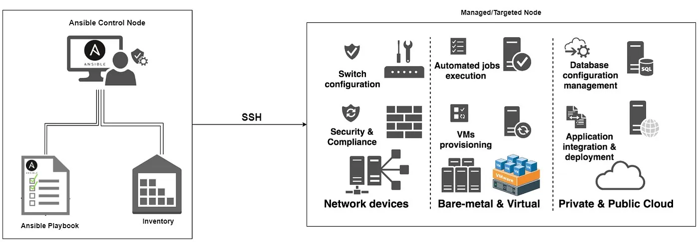

# 04.1 Manage config - Введение в Ansible

## Теория
Ansible: безагентная система управления конфигурациями по SSH через YAML файлы. (аналоги: Puppet, Chef и Salt) 
Применяется для автоматизации настройки и развёртывания программного обеспечения.  

### Архитектура

- Control node (управляющий узел): место, где установлен Ansible и откуда выполняются задачи автоматизации.
- Managed node (Управляемые/целевые узлы): серверы, которыми управляет Ansible.
- Ansible inventory: файл, содержащий список всех хостов, которыми вы хотите управлять с помощью Ansible (IP-адреса, имена хостов).
- Playbook: 
  - список сценариев для запуска Ansible
  - YAML-файлы, содержащие ряд задач, которые должны выполняться на управляемых узлах.
  - это список, состоящий из play и import_playbook.
    - play: что-то исполнить где-то
      - в поле hosts вы перечисляете где исполнять,
      - в roles/tasks — что исполнять.
    - ansible.builtin.import_playbook: импортировать

### Процесс работы
В Ansible описывается состояние системы, к которому ее нужно провести через некие действия.
- Управляющий узел запускает playbook
- Ansible устанавливает безопасный канал связи с управляемыми узлами с помощью SSH.  
- Затем Ansible выполняет задачи, определенные в плейбуке на управляемых узлах.
- Ansible является идемпотентной системой. Если система соответствует тому статусу, который ожидается, то иных изменений не будет.

#### Права доступа
По-умолчанию в Ansible существует политика выполнения команд от того пользователя, которым вы залогинились.
- `become: true`: запрос к Ansible, для использования вместо текущего пользователя root
  - будет выполняться для всех task в этом play
  - можно использовать внутри task

### Требования к node
- Control node: любая UNIX совместимая машина с установленным Python.
- Managed node

### Пример файла
```yaml
---
- name: Example playbook
  hosts: all
  vars:
    my_var: "Hello, World!"
  tasks:
    - name: Print message
      debug:
        msg: "{{ my_var }}"
    - name: Update web server configuration
      template:
        src: web.conf.j2
        dest: /etc/httpd/conf.d/web.conf
      notify: Restart web server
    
  handlers:
    - name: Restart web server
      service:
        name: httpd
        state: restarted
```

### Абстрактные компоненты Ansible Playbook
- play: "что-то" исполнить "где-то"
- пример одного play:
```yaml
- hosts: group1
  roles:
    - role1
```
- `ansible.builtin.import_playbook`: импорт

### Конкретные компоненты Ansible Play
- Name: Имя используется для идентификации плейбука.
- Hosts: Хосты из файла инвентаризации. Это может быть список хостов и их атрибутов. Файл инвентаризации обычно располагается по адресу /etc/ansible/hosts, но может располагаться в любом месте узла управления и называться как угодно.
- Become: Здесь указывается пользователь или метод повышения привилегий для выполнения задачи.
- Variables: Переменные используются для определения значений, которые можно повторно использовать в плейбуке. 
- Tasks: Единица работы, выполняемая на целевом хосте. Задачи определяются в плейбуке и могут включать в себя различные действия, такие как установка пакетов, изменение файлов конфигурации или запуск и остановка служб.
- Handlers: задачи, которые выполняются только при соблюдении определенных условий, например, после внесения изменений. Они часто используются для перезапуска служб или перезагрузки файлов конфигурации после внесения изменений. Обработчики определены в плейбуке и запускаются директивой «уведомить» в задаче. 
  - Обработчики определяются так же, как и задачи, но с другим именем.
  - Если можно что-то красиво написать без хэндлеров лучше делать без. Работают как тригеры в SQL.
- Roles: наборы задач и переменных, которые можно повторно использовать в нескольких плейбуках.
- Templates: файлы, которые можно настроить для каждого хоста во время выполнения плейбука.
- Files: Файлы копируются с управляющего узла на целевые хосты во время выполнения плейбука.
- Conditional statements: Условные операторы позволяют плейбуку выполнять задачи только при соблюдении определенных условий.

#### play vs role
Таски в плейбуке чаще всего используются либо как "клей" до/после ролей, либо как самостоятельный строительный элемент.  
Роли дают разделение сущностей и дефолты, таски позволяют прочитать код быстрее. Обычно в роли выносят более "стационарный" (важный и сложный) код, а в стиле тасок пишут вспомогательные скрипты.
- Play решает какие таски и роли на каких хостах выполнять.
- Role не решает где ей выполняться. Это решение принимает play. Роль делает то, что ей сказали, там, где ей сказали.
  - Зло в следе из глобальных переменных
- Порядок секций с тасками и ролями: `pre_tasks`, `roles`, `tasks`, `post_tasks`.
  - но в идеале: `pre_tasks`, потом `roles`, потом `post_tasks`.
- Куда вставить task? (best practice)
  - если там есть `tasks`, то надо дописать в `tasks`. 
  - если есть `roles` — надо делать роль (пусть и из одной task).

#### role
- default values: дефолтные значения  (`/default/main.yaml`)
- дополнительные каталоги для складывания файлов
  - /files, /templates
  - для переменных
  - /library: для модулей

#### hosts или ansible inventory
- Хосты могут быть заданы как локально так и скачаны из БД / удаленного сервера.
  - дефолтное расположение файла — `/etc/ansible/hosts`, 
  - может быть задано параметром окружения `$ANSIBLE_HOSTS`
  - параметром -i при запуске ansible и ansible-playbook.
- Позволяет задать конкретный хост (по названию или ip адресу), пул адресов, группы с дополнительными настройками.
- Базовый файл хоста см. [ansible_hosts.ini](../../work_directory/04/ansible_default_hosts.ini).
  - в квадратных скобках указаны имена групп управляемых узлов,

Дополнительные настройки:
- ansible_user=admin: смена пользователя для соединения
- ansible_password=qwerty: указание пароля для соединения
- ansible_port=3511: указание конкретного SSH порта


#### Смена SSH порта
через task
```yaml
- name: Change ssh port to 8888
  set_fact:
    ansible_port: 8888
```
.ssh/config и alias
```
Host de.1.before
  HostName 192.26.32.32
  Port 22

Host de.1.after
  HostName 192.26.32.32
  Port 8888
```
hosts или Ansible inventory
```
[linux-servers]
xcpng5.homelab.com ansible_port=3511
```

### Команды
- шаблон: `ansible {hosts} {flags} {command}`
- пример: `ansible all -i hosts.ini -m ping --ask-pass`
  - hosts: All означает – все хосты, которые у нас возможны.
    - пример: ansible all --list-hosts
  - -i: указать путь до файла инвентаризации
  - -m: указать модуль (из установленных)

### Встроенные модули
- ansible.builtin.apt: установка, обновление
- ansible.builtin.file: создание, удаление
- ansible.builtin.copy,

### Ansible Tasks example
Являются словарями: ключ - значения.
```yaml
  tasks:
  - name: "Install nginx via apt"
    ansible.builtin.apt:
      name: "nginx"
      state: "latest"
      update_cache: true
```
**Пример:**
- ansible.builtin.apt: используемый модуль
- name: полное имя пакета
State, как написано в документации — это в каком состоянии мы хотим найти пакет.
- present: если у вас уже есть какой-то пакет в Ansible, то state у него, соответственно, будет неизменным
- latest: если apt найдет какую-то более свежую версию пакета, то он попробует ее обновить.
- update: обновит cache всех библиотек, которые у вас лежат в архиве.

**Тип переменных**
- boolean
- string

### Troubleshoot
- `sudo apt install sshpass`
- `--ask-pass`: если доступ закрыт и нужно ввести пароль при подключении

## Задание 1. Установи и создай свой первый плейбук

### Установка
- Unix: установка
  - `python -m venv /path/to/new/virtual/environment`: создание virtual environment
  - `cd /path/to/new/virtual/environment/bin`: открываем bin каталог
  - `source activate`: загружаем настройки в терминал
  - возможно потребуется установить pip3
  - `python3 -m pip install --user ansible`: установка ansible для текущего пользователя
- `brew install ansible`: установка на macOS
- `ansible --version`: проверяем установку

### Конфигурация хостов (Ansible inventory)
- Создал базовый `/etc/ansible/hosts`
- Добавил в `/etc/ansible/hosts` группу хостов, сменив дефолтный SSH порт
```
[vm-servers]
# VM-server
10.0.0.0 ansible_port=100
# VM-childs
10.0.0.0 ansible_port=101
10.0.0.0 ansible_port=102
10.0.0.0 ansible_port=103
```
- Проверил / добавил ssh ключи на сервера:
  - `ssh-keygen -C Kirills-home-notebook -t ed25519 -c`
    - -t сменить алгоритм шифрования (rsa по-дефолту)
    - -c запросить смену комментария (-C указать сразу)
  - `ssh-copy-id -p 22101 -i ~/.ssh/id_ed25519.pub kirillkonovalov@10.10.10.10`:
    - -p: смена порта
    - -i: путь к файлу
- `ansible -m ping all`: проверка пинга до всех хостов
  - -m: использовать модуль
  - -vvvv: печать verbose информацию (диагностическую)
- получил вывод только на один хост
```JSON
10.10.10.0 | SUCCESS => {
  "ansible_facts": {
  "discovered_interpreter_python": "/usr/bin/python3.11"
  },
  "changed": false,
  "ping": "pong"
}
```
- поправил 
- Получил вывод на все хосты
```JSON
vm-child3 | SUCCESS => {
  "ansible_facts": {
    "discovered_interpreter_python": "/usr/bin/python3.11"
  },
  "changed": false,
  "ping": "pong"
}
vm-child1 | SUCCESS => {
  "ansible_facts": {
    "discovered_interpreter_python": "/usr/bin/python3.11"
  },
  "changed": false,
  "ping": "pong"
}
vm-child2 | SUCCESS => {
  "ansible_facts": {
    "discovered_interpreter_python": "/usr/bin/python3.11"
  },
  "changed": false,
  "ping": "pong"
} 
```
- `-u hryamzik`: Запуск от пользователя, вместо рута 
#### Конфигурация хостов с одним ip
- Проблема, в записи ниже ansible считает что хост один из-за одного ip адреса
```
[vm-servers]
VM-server
10.0.0.0 ansible_port=100
VM-childs
10.0.0.0 ansible_port=101
```
- Вместо ip нужно использовать hostname и задать его в ~/.ssh/config
- 
```
Host graynetfirst
  HostName pieterbr1-w7.gray.net
  Port 2200

Host graynetsecond
  HostName pieterbr1-w7.gray.net
  Port 2201
```

### Написание первого плейбука
- создал файл `hello_playbook.yml` из примера
- добавил хостов
```yaml
- # Kirill playbook playground
--- # Указывает на начало
- hosts: "all"
  become: true
  tasks:
    - name: "Install nginx via apt"
      ansible.builtin.apt:
        name: "nginx"
        state: "latest"
        update_cache: true

    - name: "Delete /var/www/html folder"
      ansible.builtin.file:
        path: "/var/www/html"
        state: "absent"

    - name: "Copy our lending to /var/www/html folder"
      ansible.builtin.copy:
        scr: "files/html" # относительный путь у контролирующей ноды
        dest: "/var/www/" # абсолютный путь у хоста
        owner: "vagrant" # права доступа unix 
        group: "vagrant" # без них будет создавать под root
        mode: "0644"     # chmod
... # Указывает на конец
```
- `ansible-playbook hello_playbook.yml -i hosts.ini`: запустил плейбук

## Задание 2. Создай еще один плейбук со всеми предыдущими действиями по настройке сервера

## Вопросы к ментору:
- В файле инветаризации можно указать пароль для входа, но если есть ssh-ключ под паролем, этот пароль для него будет использован?
## Ссылки
- Установка
  - [Ansible community documentation | Installing Ansible](https://docs.ansible.com/ansible/latest/installation_guide/intro_installation.html)
  - [Installing Ansible on specific operating systems](https://docs.ansible.com/ansible/latest/installation_guide/installation_distros.html#installing-distros)
  - [Python 3 | Virtual environment](https://docs.python.org/3/library/venv.html#creating-virtual-environments)
  - [Pip default behavior conflicts with virtualenv?](https://stackoverflow.com/questions/30604952/pip-default-behavior-conflicts-with-virtualenv)
- Конфигурация
  - [Configuring Ansible](https://docs.ansible.com/ansible/latest/installation_guide/intro_configuration.html)
  - [Автоматизируйте всё с помощью Ansible](https://habr.com/ru/companies/slurm/articles/738594/)
  - [Ansible multiple hosts with port forwarding](https://stackoverflow.com/questions/26527458/ansible-multiple-hosts-with-port-forwarding)
  - [Ansible change ssh port in playbook](https://stackoverflow.com/questions/34333058/ansible-change-ssh-port-in-playbook)
- Playbook
  - [Пишем первый плейбук Ansible](https://habr.com/ru/companies/slurm/articles/569172/)
  - [ansible.builtin.import_playbook module – Import a playbook](https://docs.ansible.com/ansible/latest/collections/ansible/builtin/import_playbook_module.html)
- [Основы автоматизации в Ansible: роли и сценарии](https://habr.com/ru/companies/slurm/articles/706920/)
- [Пособие по Ansible](https://habr.com/ru/articles/305400/)
- [Основы Ansible, без которых ваши плейбуки — комок слипшихся макарон](https://habr.com/ru/articles/508762/)
- https://habr.com/ru/articles/509938/
